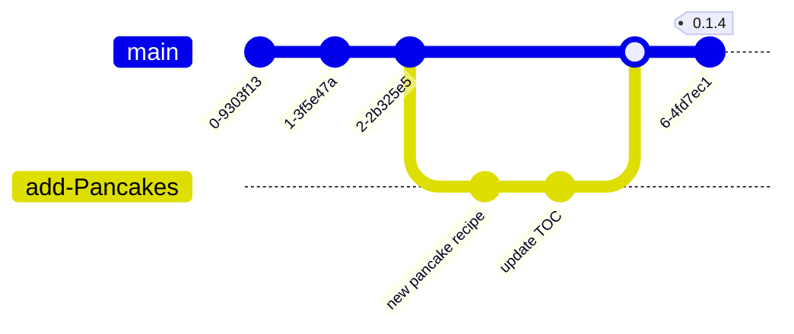

<div align=CENTER>


<h1> Git Cookbook </h1>

</div>

Yes, this is an actual cookbook with recipes for delicious food. **It is primarily used for git training**.

This repo is a place you can practice Git commands and using GitHub _without worrying about breaking anyone's code._ It is also a place to practice or learn [Markdown](https://www.markdownguide.org/) syntax.

## [👨🏻‍🍳 Recipes: Table of Contents](recipes/index.md)

<br>
<br>

# How to add a recipe

To learn and practice basic Git commands, add a recipe to this cookbook. Do you have a favorite recipe for homemade bread that was passed down from your Grandma? If its not a family secret, you can share it here!

1. Fork this repo. Click the <kbd>Fork</kbd> button on the GitHub page to make a copy of this repo to your local user account.
1. Clone your repo to your local computer.
    ```bash
    git clone <url-of-your-fork>
    ```
1. Create a new branch
    ```bash
    git branch add-Pancakes
    git checkout add-Pancakes
    ```
1. Add a new file to the `recipes/` folder and update the `index.md` table of contents.
    ```bash
    cd recipes/
    cp _template.md pancakes2.md
    # Edit pancakes2.md
    # Edit index.md to add link
    ```
1. Stage and commit your changes.
    ```bash
    # Stage Changes
    git add pancakes2.md  # To add specific files
    git add -A            # -or- add all untracked files

    # Commit changes
    git commit -m "added new pancake recipe"
    ```
1. Push changes to GitHub.
    ```bash
    git push origin add-Pancakes
    ```
1. Make a Pull Request to merge your _add-Pancakes_ branch to the _main_ branch.

Here is a visual representation of what you have done. In this example, the repo owner "tagged" the merged pull request as a new release.


