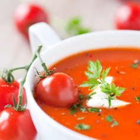

# Name of Recipe

Author: *Your Name*

> A fun fact about this recipe and why you like it.

<!-- If your image is too big, you can use HTML -->
<!--  -->

## Ingredients

* 1 cup flour
* 1/2 cup butter

## Directions

1. Stir together
1. Bake at 350o for 15 minutes
1. Cool before enjoying.
