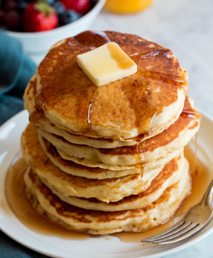

# Mom's Pancakes

Author: _Brian Blaylock_

> This is my mom's recipe for pancakes and waffles. She would make us pancakes for breakfast every Monday morning before school to get us excited about the new week.

## Ingredients

- 1 cup milk
- 1 egg
- 1 Tbsp. sugar
- 1 cup flour
- 1 Tbsp. Baking powder (or less)
- 1/2 tsp. salt
- 1/2 tsp. oil

## Directions

1. Mix milk, eggs, sugar
1. Add flour, baking powder, and salt
1. Add oil
1. Pour batter on preheated skillet or waffle iron.

### Customization

- Add 1/2 cup fresh or frozen blueberries.
- Add chocolate chips.
